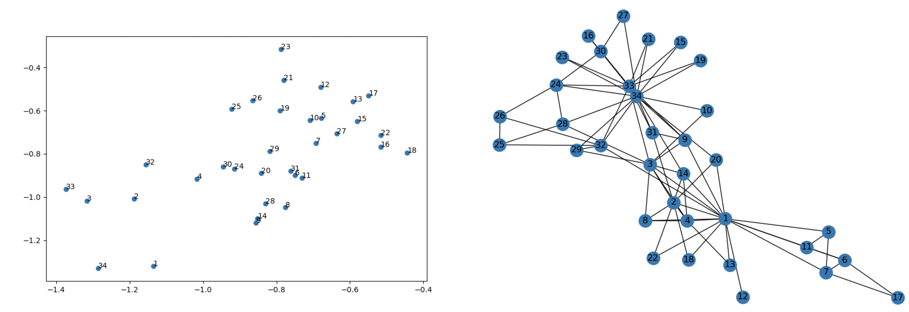
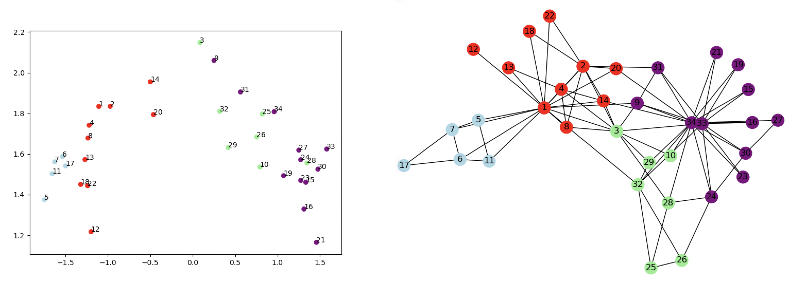

# GraVe

This code in this project can be used as a starting point for creating node-level graph embeddings using the [GloVe](https://nlp.stanford.edu/projects/glove/) 
approach (and more generally, using [Factorization Machines](https://cseweb.ucsd.edu/classes/fa17/cse291-b/reading/Rendle2010FM.pdf)). 
Much work in this space appears to have been done using the word2vec approach, with either the SkipGram or CBOW models, 
but very little has been done with the GloVe approach. 

This project makes use of the original [DeepWalk](https://github.com/phanein/deepwalk) implementation to generate the
graph random walk corpus, and the [glove_python](https://github.com/maciejkula/glove-python) project to learn the 
GloVe embeddings from the random walks.



## Example Usage

Generate DeepWalk walks:
```
python walks.py --input examples/karate.adjlist --output karate
```
This generates a file, `karate.walks.0`, which contains the corpus.

Alternatively, generate node2vec walks:
```
python node2vec_walks.py --input examples/karate.adjlist --output karate --walk-length 40 --num-walks 160
```
This generates a fie, `karate.node2vec.walks`, containing the walk corpus.

Create the GloVe embeddings:
```
python glove_training.py --create karate.walks.0 --components 2  --train 10
```
This generates two files: `corpus.model` and `glove.model`.

Inspect a trained GloVe model:
```
python inspect_model.py --model glove.model --adjlist examples/karate.adjlist
```

## Results

### Learning Node Embeddings with GloVe

A corpus of walks can be generated with the DeepWalk or node2vec approach, and then a GloVe model can be created from 
the corpus. Each vertex (i.e. node) in the graph is analogous to a word, and the walks are analogous to sentences.
Initial experiments were carried out with the Karate Club graph.

The plots below are color-coded according to the node degree: 


The plots below are color-coded according to community structure:



The embeddings for the first plot were created with a symmetric context window size of 10, whereas the embeddings for 
the second plot were created with a symmetric context window size of 1.

The plots below are color-coded according to community structure, and the embeddings were generated from a walk dataset 
that was created with the [node2vec](https://github.com/aditya-grover/node2vec) approach:


The embeddings were created with a symmetric context window size of 10.

The [Cora dataset](https://graphsandnetworks.com/the-cora-dataset/) consists of a graph with 2,708 labelled vertices and 
5,429 edges. There are 7 label classes. A walks corpus was constructed using the node2vec approach, and a GloVe model 
was created from this corpus (using a context window size of 10), resulting in 2,708 128-dimensional embeddings. Then, 
a t-SNE plot was created, using:
```
python tsne_plot.py --model examples/cora.glove.model --graph examples/cora.gpickle --iterations 5000 --perplexity 50 --learning-rate 10
```
The resulting plot, below, displays the learned representations, colored by node label:


### Jointly Learning Node Embeddings and Node Attribute Embeddings with Factorization Machines

The [attr2vec](https://www.aclweb.org/anthology/N18-1042/) approach demonstrates that words and their contextual 
attributes can be jointly learned using Factorization Machines, a generalization of the GloVe model. Essentially, an 
embedding is learned for each word and each contextual feature. Word embeddings learned this way encode (presumably)
some knowledge of the word's attributes. The GraVe project takes the attr2vec approach and applies it to graphs with
node-level attributes. These attributes are considered node-level features, and their embeddings are jointly learned 
with the node embeddings.

The vertices in the Karate Club graph are assigned one of two labels. Thus, it is interesting to ask if node-level
embeddings can be learned that also encode these labels (i.e. attributes). A Factorization Machine model was created 
based on the Karate Club graph, where the nodes were additionally associated with these labels (see 
`karate2_labels_fm_training.py`). The results are displayed below:


It appears that the embeddings are clustered according to community structure, but also by label. The results 
demonstrate that embeddings can encode node-level attributes. The points in the plot on the left have labels colored 
according to the node labels. That is, the points with yellow text belong to the "Mr. Hi" class, while the points with 
the black text belong to the "Officer" class.  