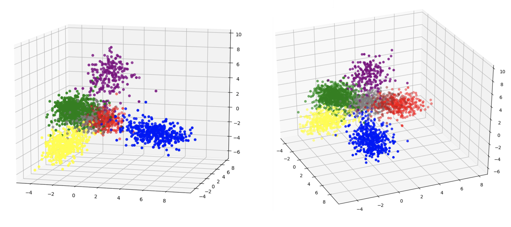

The Cora dataset associates a binary feature vector with each node. This feature vector has 1,433 components, each 
indicating the presence or absence of a particular word in the paper represented by the node. LDA was used to reduce 
the number of components in the feature vector to 3, as each node is also assigned 1 of 7 labels. The 3D scatter plots 
above depict the results (the same plot is shown from two different angles).    