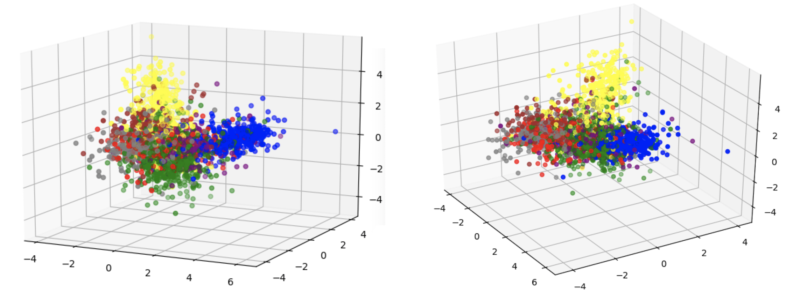

The Cora dataset associates a binary feature vector with each node. This feature vector has 1,433 components, each 
indicating the presence or absence of a particular word in the paper represented by the node. LDA was used to reduce 
the number of components in the feature vector to 3, as each node is also assigned 1 of 7 labels. The 3D scatter plots 
above depict the results (the same plot is shown from two different angles). The colors represent the different labels. 

The 128-dimensional GloVe embeddings for the nodes of the Cora graph were reduced to 3 dimensions using LDA and the 
corresponding label for each node. The 3D scatter plots above depict the results (the same plot is shown from two 
different angles). The colors represent the different labels.